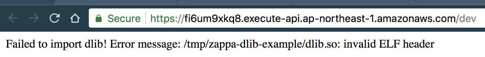

# zappa-dlib-example


Testing how can we deploy project with [dlib](https://github.com/davisking/dlib)
by [Zappa](https://github.com/Miserlou/Zappa).

Zappa uses [lambda-packages](https://github.com/Miserlou/lambda-packages)
which can automatically deploy pre-build packages for projects with C backends (ex. numpy, opencv).  
And dlib is included in lambda-packages [here](https://github.com/Miserlou/lambda-packages/tree/master/lambda_packages/dlib),
but I can't used it on AWS lambda in actual.  

I created an issue, [Miserlou/Zappa#1477](https://github.com/Miserlou/Zappa/issues/1477), to get solution for this.


## Usage

```bash
virtualenv venv
. venv/bin/activate
pip install -r requirements.txt

./runserver.py
```


## How to deploy to AWS lambda?

```bash
zappa deploy
zappa status
zappa update
```


## Expected behavior


## Actual behavior

It is live at https://fi6um9xkq8.execute-api.ap-northeast-1.amazonaws.com/dev.


